<div align="center">


# G-one
### Personal health awareness. Local intelligence. User-controlled sharing.

An Android health companion connecting a wearable prototype, local anomaly detection, on-device AI and optional emergency assistance.

**Kotlin · Jetpack Compose · ESP32-S3 · Bluetooth LE · llama.cpp · Room**

[Visual tour](#visual-tour) · [Architecture](#architecture) · [Features](#feature-guide) · [Performance](#performance-and-verification) · [Build](#build-and-run) · [Documentation](#documentation)


[Explore the website](https://g--one.vercel.app/) · [Try the web demo](https://g--one.vercel.app/demo) · [Explore hardware](https://g--one.vercel.app/hardware)

</div>

<table>
<tr><td align="center"><strong>LOCAL ANALYSIS</strong><br/>Rules first, AI explanations second</td><td align="center"><strong>ANDROID + WEARABLE</strong><br/>ESP32-S3 · Bluetooth LE · Compose</td><td align="center"><strong>USER CONTROL</strong><br/>Optional sharing and emergency assistance</td></tr>
</table>

---

## At a glance

G-one brings physiological readings into one local workflow: **collect → validate → store → detect → alert → explain**. Its Android app monitors a connected wearable, displays trends, records sessions, explains findings and helps users understand text from reports or screenshots without sending those inputs to a cloud language model.

The central design decision is to keep **detection independent of text generation**. A deterministic rule engine creates an alert with a usable explanation first. A local language model can subsequently improve the wording; model loading, timeout or failure must not prevent the original alert.

| Area | Current implementation |
|---|---|
| Mobile application | Native Android, package `com.gone.ai`; API 24+; ARM64 build |
| Wearable | ESP32-S3 strap prototype with pulse/SpO₂, skin temperature, motion and EMG inputs |
| Health analysis | Local validation, aggregation, rules, baselines and risk indicators |
| Language model | Qwen2.5-1.5B-Instruct, GGUF Q4_K_M, CPU inference through llama.cpp/JNI |
| Persistence | App-private Room database, preferences and files |
| Optional connectivity | City AQI, consented emergency snapshots, SMS/calling and Android speech services |
| Development stage | Prototype with automated tests and recorded bench/phone checks; not a clinically validated medical device |

**Scope matters:** sleep and stress are self-reported journals. AQI is a regional online estimate. NFC opens a saved emergency record. Current wearable firmware is live-only and cannot recover disconnected readings. Later PCB and chest-patch models are design assets, not proof of manufactured or validated hardware.

## Contents

- [Visual tour](#visual-tour)
- [Problem and use cases](#problem-and-use-cases)
- [Architecture](#architecture)
- [End-to-end workflows](#end-to-end-workflows)
- [Feature guide](#feature-guide)
- [Hardware and protocol](#hardware-and-protocol)
- [Implementation details](#implementation-details)
- [Privacy and connectivity](#privacy-and-connectivity)
- [Technology stack](#technology-stack)
- [Performance and verification](#performance-and-verification)
- [Engineering comparisons](#engineering-comparisons)
- [Build and run](#build-and-run)
- [Repository map](#repository-map)
- [Limitations and future scope](#limitations-and-future-scope)
- [Documentation](#documentation)

## Visual tour

### Explore the web experience

Actual captures of the public website, taken on **22 September 2026**. Click a preview to open the corresponding page.

<table>
<tr>
<td width="50%"><a href="https://g--one.vercel.app/">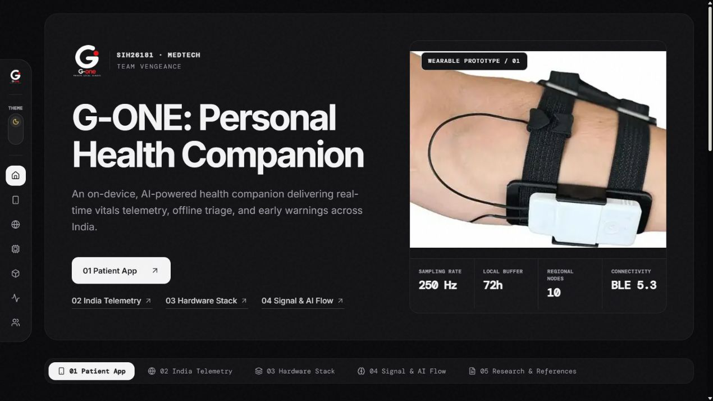</a><br/><strong>01 / Project gateway</strong><br/>The wearable, project identity and platform entry points.</td>
<td width="50%"><a href="https://g--one.vercel.app/demo">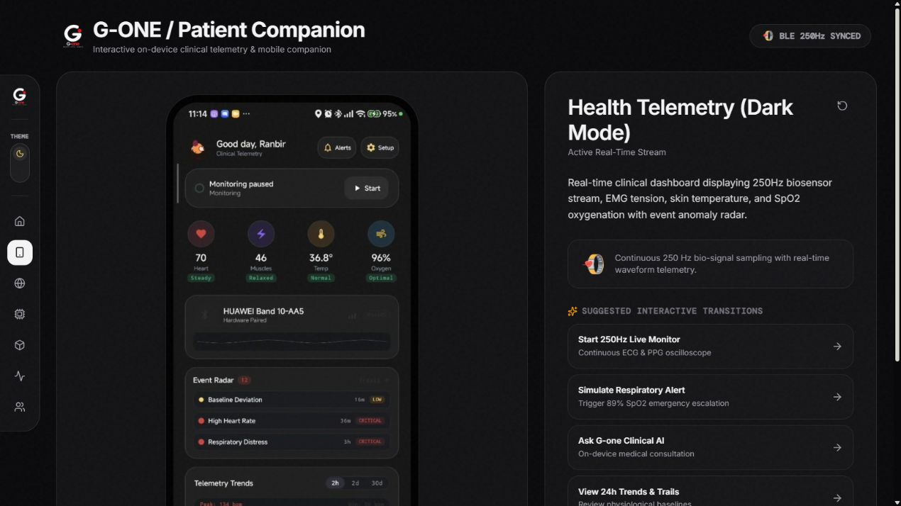</a><br/><strong>02 / Patient companion demo</strong><br/>A browser presentation of the mobile experience.</td>
</tr>
<tr>
<td width="50%"><a href="https://g--one.vercel.app/hardware">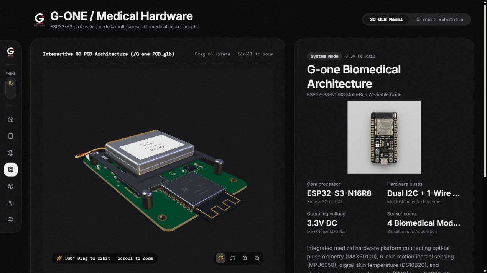</a><br/><strong>03 / Hardware explorer</strong><br/>Interactive 3D board presentation and component details.</td>
<td width="50%"><a href="https://g--one.vercel.app/e">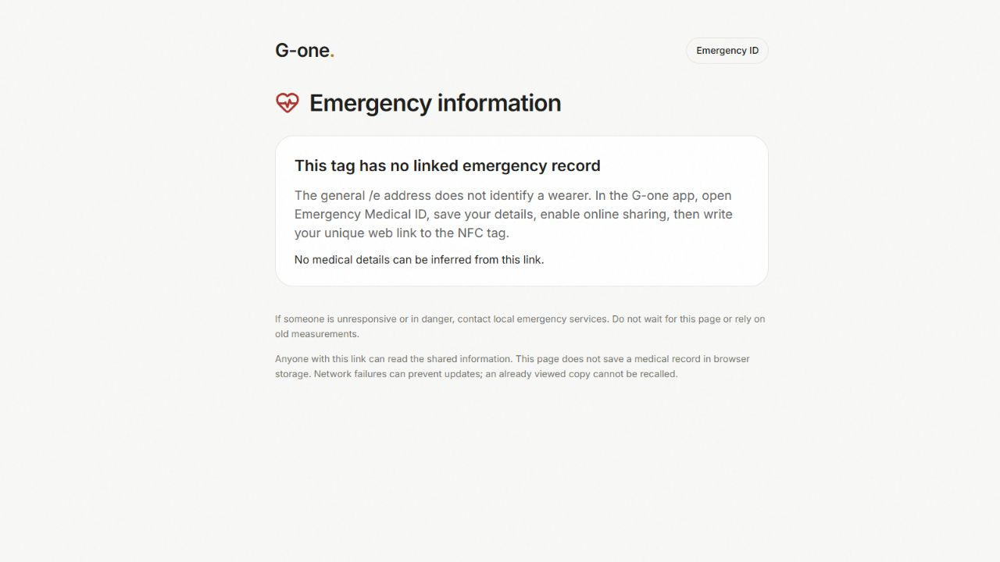</a><br/><strong>04 / Emergency ID entry</strong><br/>Public setup state; no personal emergency record is exposed here.</td>
</tr>
</table>

> **Preview versus implementation:** website copy includes presentation claims such as 250 Hz streaming and a 72-hour buffer. These screenshots show the website as published; they do not verify those claims for this Android build. The audited feature descriptions, live-only firmware limitations and performance evidence below remain authoritative. The browser demo is not a live patient feed.

### From prototype to form-factor exploration

<table>
<tr>
<td width="50%"><a href="docs/assets/phase1-worn.png">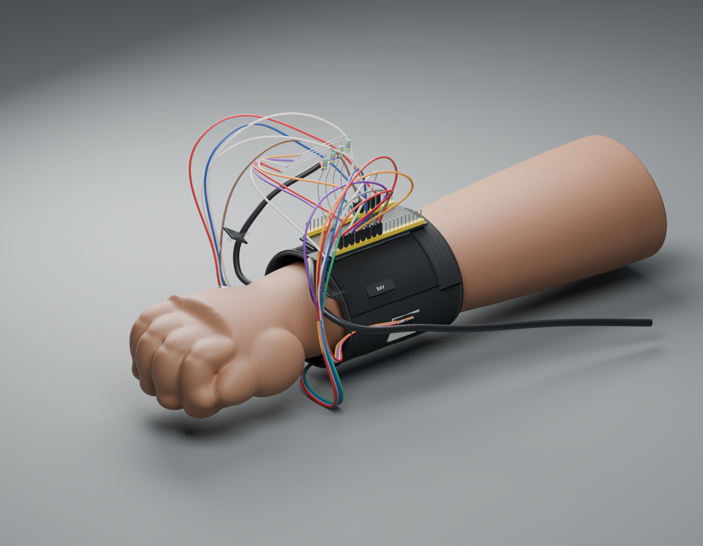</a><br/><strong>Phase 1 / Strap reconstruction</strong><br/>Blender visualization of the module-based prototype, wiring and worn fit.</td>
<td width="50%"><a href="docs/assets/pcb-concept.png">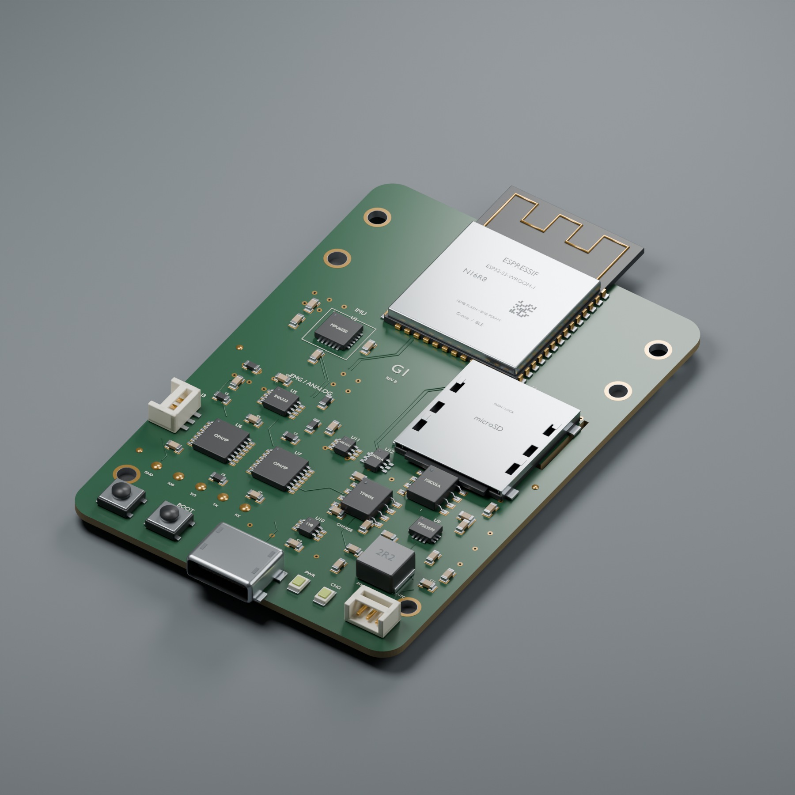</a><br/><strong>Later phase / Compact PCB</strong><br/>Component placement and board presentation concept.</td>
</tr>
</table>

<details>
<summary><strong>Open the Jeevan Core exploded-view render</strong> — enclosure, electronics and skin interface</summary>

<p align="center"><a href="docs/assets/core-exploded.png">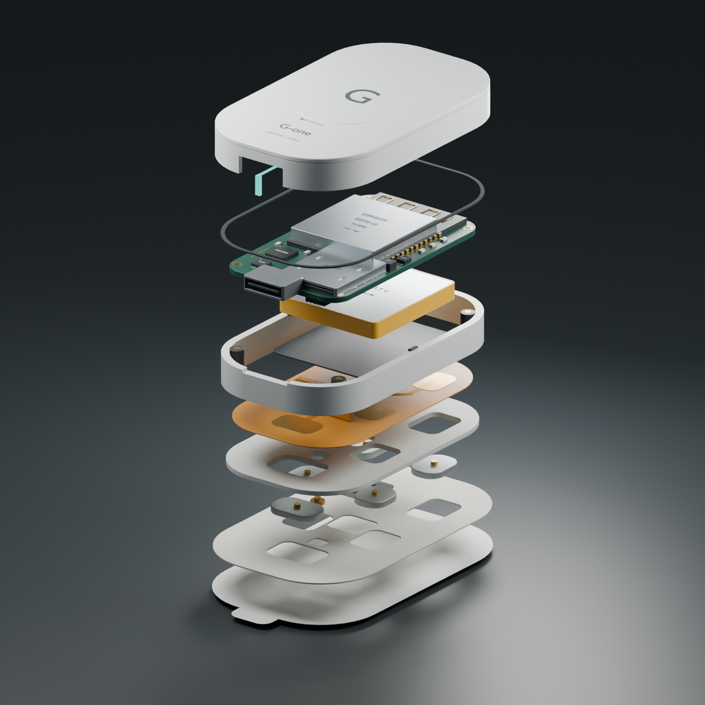</a></p>

An existing Blender concept render, not a manufacturing drawing or a claim that all depicted parts are present in the Phase-1 wearable. [Explore the design assets](hardware/jeevan-core).

</details>

### Android interface gallery

<details>
<summary><strong>Open the Android screenshots</strong> — AQI, sleep and stress</summary>

<table>
<tr>
<td width="33%" align="center"><a href="docs/assets/app-aqi.png">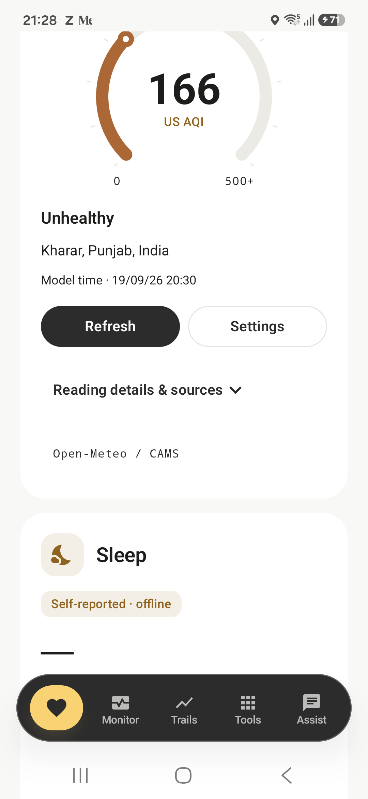</a><br/><strong>Environmental context</strong><br/>Regional US AQI with source and model time.</td>
<td width="33%" align="center"><a href="docs/assets/app-wellness.png">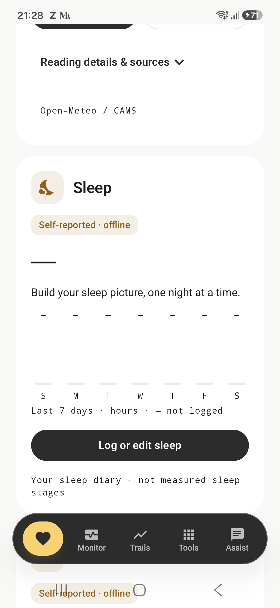</a><br/><strong>Sleep journal</strong><br/>Seven-day view with honest unlogged states.</td>
<td width="33%" align="center"><a href="docs/assets/app-stress.png">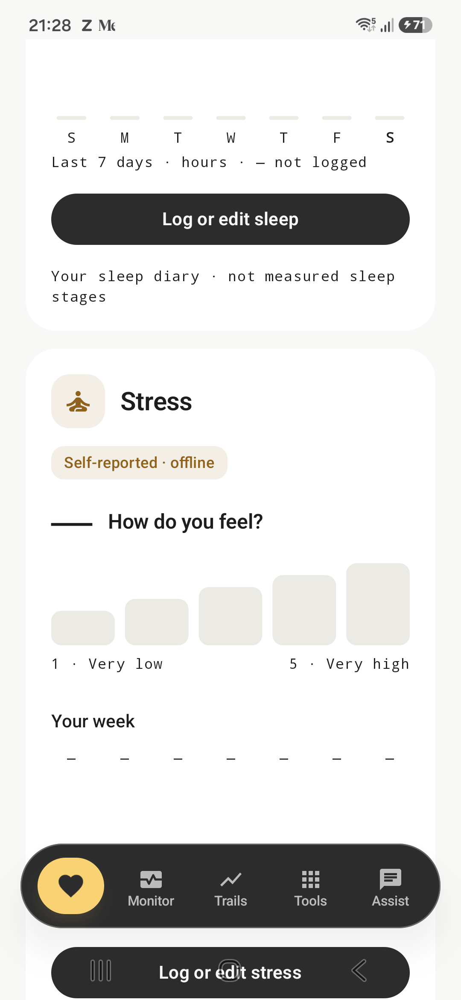</a><br/><strong>Stress check-in</strong><br/>Self-reported levels and weekly reflection.</td>
</tr>
</table>

Existing phone captures from the repository's companion-visuals artifacts. These show earlier captured UI states, not a new device test or current AQI. No values were fabricated to fill the empty journals.

</details>

All gallery images are stored in this repository. Captions distinguish website captures, Android screenshots and Blender renders. [Asset sources and capture notes](docs/assets/README.md#visual-gallery-provenance).

[Back to contents](#contents)

## Problem and use cases

The project addresses a personal health companion problem: retain useful health awareness when connectivity is unreliable, keep sensitive analysis local and turn raw measurements into understandable information.

| Use case | What G-one provides | Boundary |
|---|---|---|
| Daily health awareness | Live readings, trends, baseline deviations and session summaries | Sensor quality and continuous connection determine available data |
| Heat exposure awareness | Rule-based indicators when required inputs exist; optional AQI context | Does not diagnose dehydration or predict disasters |
| Motion monitoring | Immediate high-impact fall rule and optional automatic SOS | A 5 g gate limits false alarms but can miss lower-impact falls; requires physical validation |
| Understanding documents | OCR, text extraction, local summaries and Assist | Generated explanations may be wrong; not image-based diagnosis |
| Emergency information | Consented profile snapshot accessed through NFC/QR URL | Internet required for a new online lookup; record may be stale |
| Wellness reflection | Sleep journal, stress check-ins, seven-day views and reminders | Self-reported rather than sensor-inferred stages or stress |
| Demonstration/development | Simulated readings, detector tests and protocol emulator | Simulation is distinguished from live data and cannot send automatic SOS |

Disaster-response and public-health deployment are potential applications, not existing institutional integrations. Flood/cyclone advisories and automated disaster feeds are not implemented.

## Architecture

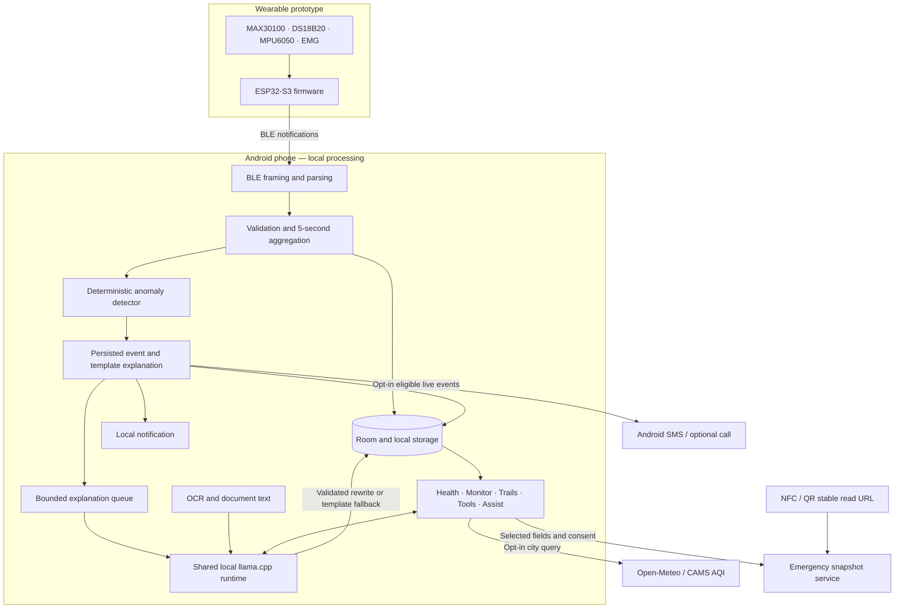

The wearable gathers signals; the **phone** runs the language model. The ESP32 does not run the bundled 1.5B model. BLE acquisition, persistence and anomaly processing are separate from serialized model inference.

| Responsibility | Owner |
|---|---|
| Source identity and valid fields | Sensor source and parser |
| Aggregation, persistence, detector invocation | Monitoring pipeline |
| Structured anomalies from windows and thresholds | Detector |
| Asynchronous wording improvement with fallback | Explanation worker |
| Shared native model access and lifecycle | AI repository |
| Reactive presentation and user actions | Compose UI and ViewModels |
| Explicit, selected data sharing | Optional integration services |

## End-to-end workflows

### A live reading becomes an alert

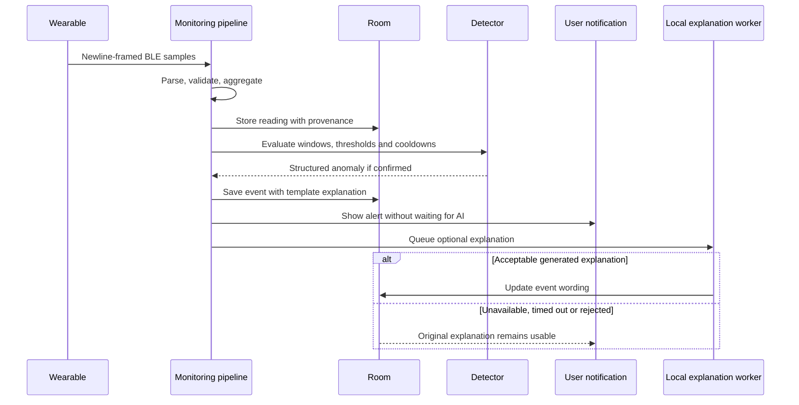

Sensor acquisition, five-second aggregation, rule duration requirements and Android scheduling contribute to total latency. No measured end-to-end latency guarantee is claimed.

### A document becomes understandable text

1. Select an image, capture with the camera, import supported document content or use consented screen capture.
2. Extract text locally. PDF text extraction and OCR are distinct paths; this is not a multimodal diagnostic model.
3. Review/select extracted text with meaningful symbols, numbers and spacing preserved.
4. Run a local summary, explanation or quiz within the model's token budget.
5. Read formatted output; copy, share or save to Memory Vault. Completed tool results can be saved automatically; incomplete output is handled separately.

### An NFC record stays updateable

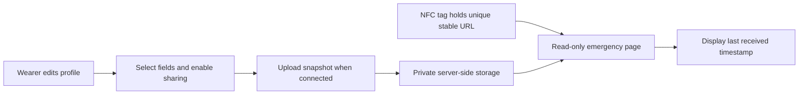

The tag stores an address, **not a live copy of the database**. Updating the record behind that address lets the same tag show newer information without rewriting it. The generic `/e` route is setup entry; personal records use `/e/<read-id>`. An offline/static NFC payload is a separate mode and must be rewritten when its contents change.

## Feature guide

### Health, monitoring and sessions

| Feature | Behavior |
|---|---|
| Live monitoring | BLE connection, validated values, source-aware charts and explicit missing/standby states |
| Temperature | Skin temperature stays separate from core temperature; DS18B20 skin readings do not become core fever measurements |
| Trends and baselines | Historical windows, baseline comparisons and internal heat/respiratory/cardiovascular indicators |
| Sessions | Start/stop monitoring sessions, review recorded data and generate a PDF report |
| EMG calibration | Calibration workflow; raw ADC magnitude is not universal across users |
| Simulation | Development/demo sources distinguishable from real input |
| Wellness journal | Bed/wake times, awake minutes, sleep quality and daily stress ratings; edit/delete entries |
| AQI | Optional city selection, animated regional US-AQI display and retained last successful reading |

### Anomaly detection

The detector implements **13 rule IDs**. Rule presence does not mean the current hardware supplies every required input or that every risk is medically established.

| Rule ID | Purpose |
|---|---|
| `spo2.critical` | Critical low-oxygen reading |
| `spo2.sustained` | Sustained low-oxygen pattern |
| `hr.high` / `hr.low` | Sustained high/low heart-rate patterns |
| `temp.fever` | Elevated core-temperature input, when available |
| `env.heatStress` | Combined heat-stress indicators |
| `env.dehydrationRisk` | Indirect dehydration-risk indicators |
| `resp.distress` | Combined respiratory-risk pattern |
| `cardio.strain` | Combined cardiovascular-strain pattern |
| `motion.fall` | High-impact event with supporting rule conditions |
| `wellness.fatigue` | Fatigue-related pattern |
| `emg.sustainedHigh` | Sustained elevated muscle activity |
| `baseline.deviation` | Departure from a personal baseline |

Thresholds, windows and cooldowns live in [domain configuration](app/src/main/java/com/gone/ai/health/domain/AnomalyThresholds.kt) and [rule implementations](app/src/main/java/com/gone/ai/health/detect/AnomalyRules.kt). Risk scores are engineering indicators, not probabilities of disease. Missing values must not become zeros or evidence of immobility.

### Emergency assistance

- Automatic SOS is opt-in and requires a saved contact and SMS permission.
- Every confirmed eligible **live** wearable anomaly, including low/moderate findings, can trigger a message. Motion additionally requires a finite impact of at least **5.0 g**.
- Events combine for **1.5 seconds** to reduce duplicate messages from a reading. Detector checks and cooldowns still apply; there is no user countdown.
- Simulated readings, historical replay and AQI do not trigger automatic SOS.
- Calling is separately permissioned. Manual Tools actions open the SMS composer or dialer.
- A working SIM and mobile service are required. A send callback does not prove delivery or that the recipient read the message.

See [SOS behavior](docs/SOS_BEHAVIOR.md) for exact semantics and remaining physical tests.

### Assist and AI tools

| Tool | Implementation |
|---|---|
| Assist | Streaming local chat, formatted headings/lists/code/tables, drafts during generation, stop/retry, history and message actions |
| Personal context | Explicitly selected health/document context constrained before entering the prompt |
| OCR | Local ML Kit recognition, selectable results and preserved numeric/symbol content |
| Screenshot AI | Text-led explanation of captured/imported screen content |
| Circle to Search | Permission-based screen capture/overlay workflow for selected content |
| Quiz generator | Questions, answer feedback and score when output parses; raw-output fallback otherwise |
| Memory Vault | Local saved scans, summaries and quizzes; search and deletion workflows |
| Voice | Android recognition and text-to-speech; offline recognition preferred but not guaranteed |
| Wellness tools | General educational guides and reminders, not a treatment service |

General chat output is not covered by the same constrained health-event rewrite validation. It can hallucinate, omit context or produce misleading advice.

### AQI, sleep and stress

AQI is **off by default**. Open-Meteo/CAMS supplies modeled **US AQI**, distinct from India's National AQI and an on-body sensor. Successful refreshes are at least 15 minutes apart while Home is visible; failures are throttled to one minute and requests time out after ten seconds. Values older than three hours are stale. Failure preserves the last good reading and timestamps; changing city invalidates the old cache.

Sleep uses entered bedtime, wake time, awake minutes and quality (1–5). Stress is a self-reported daily 1–5 scale. Seven-day trends exclude missing days from averages. Each journal allows one entry per date and up to 365 entries. These are longitudinal records, not automatic sleep staging or physiological stress detection.

## Hardware and protocol

### Current Phase-1 wearable

| Component | Function | Detail |
|---|---|---|
| ESP32-S3 development board | Acquisition and BLE | N16R8 build configuration; 3.3 V logic, 12-bit ADC |
| MAX30100 breakout | Heart rate and SpO₂ | Board may say “MAX30100/30102”; current firmware uses MAX30100 driver |
| DS18B20 | Skin temperature | GPIO 4; 1-Wire pull-up unless already present |
| MPU6050 | Acceleration/motion | Separate I²C bus GPIO 6/7; configured ±8 g |
| EMG module and contacts | Muscle activity | ADC1 GPIO 1; input must remain within 3.3 V |
| Strap, wiring, resistors | Physical prototype assembly | Real module-based prototype construction |

Pulse I²C uses GPIO 8/9. Power arrangements are in the [hardware guide](docs/HARDWARE_SETUP.md); there is no measured battery telemetry without additional hardware. A parts-list battery capacity does not establish measured runtime.

**Current firmware has no SD logging.** The app contains a richer acknowledged/backfill protocol and emulator, but the sketch sends live readings only. Out-of-range samples are lost; firmware does not implement the full ACK/STOP protocol.

### BLE contract

| Item | Value / behavior |
|---|---|
| Advertised name | `G-one Wearable` |
| Service / characteristic | `FFE0` / `FFE1` |
| Transport | Notifications and writes without response; requested MTU 185 |
| Framing | Newline-terminated ASCII; split/coalesced notifications handled |
| Payload | Comma-separated `KEY:VALUE`; unknown fields ignored |
| Typical keys | `HR`, `SPO2`, `STEMP`, `MOT`, `EMG`, `EMGPK`, `EMGBITS`, `ST`, `TS` |
| Clock sync | Phone sends `T:<epoch_ms>` |
| Temperature | `STEMP` is skin; `TEMP` is core and is not sent by current hardware |

See [the protocol](docs/WEARABLE_PROTOCOL.md) for accepted ranges, status flags and replay behavior.

### Hardware design assets

| Directory | Role |
|---|---|
| [Phase-1 strap](hardware/gone-phase1-strap) | Prototype visualization and related assets |
| [PCB concepts](hardware/gone-pcb-3d) | Later compact-board models |
| [Jeevan Core](hardware/jeevan-core) | Final-phase chest/arm patch concept and layered presentation assets |

Renderings do not establish routing correctness, assembly feasibility, biocompatibility, waterproofing, battery life or certification. Additional ECG/bioimpedance/environmental parts in concepts are not automatically part of current firmware.

## Implementation details

### Local inference lifecycle

Kotlin accesses a C++ JNI bridge calling vendored llama.cpp/ggml CPU code. The AI repository manages shared ownership so tools and chat do not create independent model copies. Requests are serialized; cancellation and lease tracking control inference and release. The runtime reuses a shared prompt prefix when possible.

The model is bundled as an asset and copied to app-private storage. This allows first use without a model download but increases APK and installed storage. An idle model releases after the final lease has been closed for 60 seconds.

### Prompt and output boundaries

Conversation, selected health context and attachments share a finite token window. Budgets constrain input growth while reserving response space. Document tools use a smaller per-step budget. Health explanations have a timeout and validation; the existing template remains when generated text is unavailable or rejected.

### Persistence and resilience

Room stores records using exported schemas and migrations; the current schema is **version 5**. Preferences hold settings and journal/cache state. Coroutine flows feed the UI. A bounded explanation queue can discard an obsolete rewrite request under pressure without discarding the already-persisted anomaly.

Absent readings, stale AQI, interrupted generation, pending uploads/deletions and missing permissions should remain explicit rather than being replaced with plausible-looking data.

## Privacy and connectivity

“Local AI” does not mean every feature is network-free or that stored data is encrypted.

| Path | Local by default? | What can leave the phone |
|---|---|---|
| Detection and language inference | Yes | No cloud LLM request required |
| OCR and Vault | Yes | User-directed exports/sharing |
| Sleep/stress journal | Yes | Stored in app-private preferences |
| AQI, if enabled | No | City search/centre coordinates; request IP is visible to service |
| Emergency profile, if enabled | No | Selected snapshot fields; optionally dated live vitals |
| Automatic SOS, if enabled | Carrier service | SMS/call to configured contact |
| Voice recognition | Depends on Android service | May use online recognition if offline service unavailable |

The local database is app-private SQLite, **not an encrypted-database implementation**. Backup exclusions reduce unintended exposure but do not replace encryption or device security.

### Emergency sharing security model

The companion web application is maintained separately. The phone creates a random edit secret and derives a separate read identifier. Write/delete operations require the edit credential; readers receive a capability URL. Server storage credentials belong on the server, never in the APK.

Anyone possessing the read URL can access its shared record. It is read-only and displays the last-received time. Visible pages poll; uploads are best-effort and depend on connectivity/background scheduling. Revocation completes only after server deletion succeeds. Losing the edit key through uninstall/data clearing can prevent owner management of an existing record.

See [NFC emergency sharing](docs/NFC-EMERGENCY-SHARING.md) for provisioning, refresh, deletion and deployment.

## Technology stack

| Layer | Technology / configured version |
|---|---|
| Language | Kotlin 2.0.21 |
| UI | Compose BOM 2024.09.00, Material 3, Navigation 2.8.9 |
| State | ViewModel, coroutines, Flow/StateFlow |
| Data | Room 2.7.1, DataStore 1.1.7, app-private files/preferences |
| Recognition | ML Kit text recognition 16.0.1 |
| Animation / QR | Lottie 6.6.2 / ZXing 3.5.3 |
| Model runtime | llama.cpp/ggml, C++17, JNI, CPU/ARM NEON |
| Android build | AGP 8.10.1, Gradle 8.11.1, compile/target SDK 36 |
| Native build | NDK 28.2.13676358, CMake 3.22.1 |
| Firmware | ESP32 Arduino sketch and sensor libraries |
| Tests | JVM unit tests, Android instrumentation, lint, Python protocol emulator |
| Companion service | Separate Next.js application and private server-side emergency storage |

Version authority: [catalog](gradle/libs.versions.toml), [Android configuration](app/build.gradle.kts) and [native build](app/src/main/cpp/CMakeLists.txt).

## Performance and verification

### Evidence, not promises

These results distinguish measured artifacts, historical observations and configured limits. They are not a clinical evaluation or a cross-device benchmark.

| Evidence | Result | Scope |
|---|---|---|
| Existing JVM test XML inspected | **590 tests**, 66 classes, 0 failures, 0 errors | Local `testDebugUnitTest` reports; not rerun for this documentation edit |
| Release APK inspected | **1,182,249,970 bytes** / **1,127.48 MiB** | Current local artifact; future builds can change |
| GGUF inspected | **1,117,320,736 bytes** / **1,065.56 MiB** | Model asset, also stored uncompressed in this APK |
| Model share of APK | **94.51%** | GGUF ZIP-entry bytes / complete APK bytes |
| Recorded prompt processing | **28.9 tokens/s** | One historical quiz prefill on Samsung SM-S721B; not generation speed or median |
| Recorded firmware compile | **672,243 bytes flash**, **36.1 KB RAM** | Historical envelope-EMG build; about 21% of 3 MB app partition and 11% reported RAM |
| Recorded protocol self-test | **10 scenarios passed** | Simulated sync; not proof of SD support in current firmware |

[VERIFICATION.md](VERIFICATION.md) records historical device/firmware observations and older test counts. It is an evidence log, not a claim that every current screen and sensor has been rechecked.

### Model footprint and compression

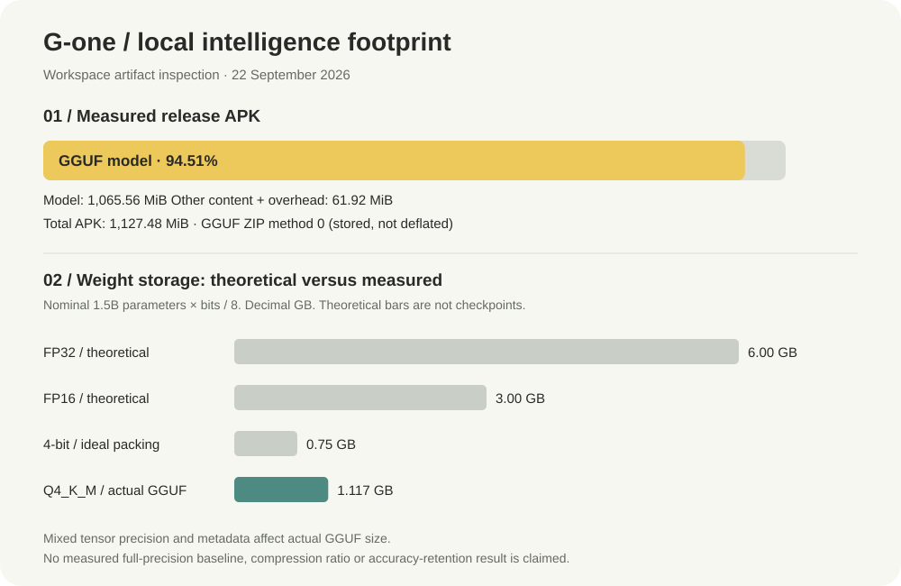

The upper chart uses actual local bytes. Its remainder includes code, native libraries, resources, other assets and archive/signing overhead; it is not a measurement of Kotlin code alone.

The lower chart explains quantization using **nominal 1.5-billion-parameter arithmetic**: FP32 = 6.00 GB, FP16 = 3.00 GB, ideal four-bit packing = 0.75 GB. These are theoretical raw-weight sizes, **not downloaded checkpoints or measured compression benchmarks**. The actual Q4_K_M GGUF is 1.117 GB; mixed tensor precision and metadata mean it is not equivalent to packing every parameter into four bits. No full-precision baseline was measured, so no empirical compression ratio or accuracy-retention claim is made.

Direct GGUF inspection reports `general.name = qwen2.5-1.5b-instruct`, `general.architecture = qwen2`, `general.file_type = 15` (Q4_K_M), but `general.size_label = 1.8B`. The nominal 1.5B chart is educational arithmetic based on the model name, not an asserted exact tensor count; this metadata discrepancy reinforces the need to pin model provenance.

### Configured resource budgets

| Setting | Value | Meaning |
|---|---|---|
| Context window | 4,096 tokens | Configured context, not unlimited memory |
| Prompt budget | 3,568 tokens | Reserves 512 output tokens plus 16-token margin |
| Maximum response | 512 tokens | Per-generation upper bound |
| CPU threads / GPU layers | 4 / 0 | CPU execution; no GPU/NPU acceleration claim |
| Native batch / microbatch | 512 / 512 | Configuration, not throughput |
| Health / attachment context | 600 / 900 tokens | Chat context budgets |
| Document step | 640 tokens | Tool document budget per step |
| Idle model release | 60 seconds | After final lease closes |
| Live aggregation | 5 seconds | Contributes latency before evaluation |

### Efficiency choices

| Choice | Benefit | Trade-off |
|---|---|---|
| Quantized model | Smaller storage than nominal full-precision weights; offline inference | Quality trade-off unbenchmarked; substantial memory/storage remains |
| Shared model runtime | Avoids independent instances per tool | Requests compete for serialized inference |
| Prompt-prefix reuse | Can avoid repeated work | Depends on prompt continuity; no measured speedup provided |
| Bounded explanation queue | Generative backlog does not control alert creation | Some rewrites may be omitted |
| Template-first alerts | Usable text survives model failure | Less personalized language |
| Cached AQI | Last-known context during network failure | Not current; timestamps remain essential |
| Bundled model | No first-use download | Large APK plus separate extracted model copy |

**Not measured:** sustained generation throughput, time-to-first-token percentiles, peak RSS, battery drain, thermal throttling, multi-day wearable runtime, detector sensitivity/specificity or controlled quantization quality. Publish those only after a reproducible device/data evaluation.

## Engineering comparisons

This compares design approaches, not benchmark results against commercial products.

| Dimension | G-one today | Alternative and trade-off |
|---|---|---|
| Health event decision | Local deterministic rules | LLM-only decisions are flexible but harder to reproduce and validate |
| Language assistance | Local quantized model | Cloud models introduce network and data-transfer dependencies |
| Sensor storage | Phone persistence from live BLE | Wearable buffering improves gap recovery but needs firmware/storage support |
| Emergency NFC | Stable URL to updateable snapshot | Static payload works without a server but needs rewriting after edits |
| Environmental context | Optional modeled city AQI | Local air-quality hardware adds measurements but also hardware/calibration needs |
| Sleep/stress | Transparent user journal | Automatic inference needs suitable signals and independent validation |

## Build and run

### Prerequisites

- Android Studio or command-line Android toolchain with JDK 17+.
- SDK 36, NDK 28.2.13676358 and CMake 3.22.1.
- ARM64 Android device, API 24+, with room for the APK, extracted model and application data.
- Vendored native source at `app/src/main/cpp/llama/`.
- Compatible Qwen2.5-1.5B-Instruct Q4_K_M GGUF at `app/src/main/assets/models/qwen.gguf`.

The model exists in this workspace, but large model files may not be included in a checkout. Its setup note does not yet pin an exact download/revision/checksum; obtain the intended licensed artifact and verify it before distributing a reproducible build. An arbitrary file renamed `qwen.gguf` is not equivalent.

### Build and checks

Run from the root in PowerShell:

```powershell
.\gradlew.bat :app:assembleDebug
.\gradlew.bat :app:testDebugUnitTest :app:lintDebug
.\gradlew.bat :app:connectedDebugAndroidTest
python tools/wearable-emulator/emulate.py --selftest
```

Instrumentation requires a compatible connected device. The Python self-test does not require a wearable. Native compilation must use the vendored implementation; a fallback stub is not a working AI runtime. Do not run legacy `setup_llama.ps1` over a working vendored tree.

| Output | Relative path |
|---|---|
| Debug APK | `app/build/outputs/apk/debug/app-debug.apk` |
| Release directory | `app/build/outputs/apk/release/` |
| JVM test report | `app/build/reports/tests/testDebugUnitTest/index.html` |
| Lint report | `app/build/reports/lint-results-debug.html` |

For release, provide local signing configuration through the existing `keystore.properties` mechanism, then run `:app:assembleRelease`. Keep credentials/keystores private. Without signing configuration the release can be unsigned and cannot be installed as a signed release.

### First run

1. Install the APK; allow model preparation when first needed.
2. Select a real wearable or explicitly enable simulation for a demonstration.
3. Grant requested Bluetooth/notification permissions, select the wearable and start monitoring.
4. Check readings/contact quality before relying on charts; calibrate EMG for the setup.
5. Open Assist or a document tool and verify local model loading/streaming.
6. Configure AQI, emergency sharing and SOS individually. Test device-dependent behavior deliberately before relying on it.

### Troubleshooting

| Symptom | Check |
|---|---|
| AI engine not set up | Confirm vendored `llama/include/llama.h` exists and native build did not select stub |
| Model fails to load | Complete compatible GGUF, free storage and successful asset extraction |
| Empty pulse chart | MAX30100 driver, bus wiring/pull-ups, contact and status flags; absent data must not produce a fabricated graph |
| No health alert | Monitoring, valid inputs, rule duration/cooldown and notification permission |
| Template explanation remains | Model unavailable, timeout or rejected rewrite can intentionally retain fallback |
| NFC shows old details | Sharing selection, successful upload and snapshot timestamp; scanning does not upload app edits |
| APK cannot update installed app | Check signing identity and install error; different keys prevent in-place updates |

## Repository map

```text
app/
  src/main/java/com/gone/ai/
    ai/                 Shared inference and runtime lifecycle
    chat/               Conversation prompt/context handling
    health/             Sources, detection, storage, SOS and UI
    ocr/                Text extraction and document AI processing
    circle/             Screen capture and overlay tools
    data/library/       Room database and local library
  src/main/cpp/         JNI and vendored llama.cpp/ggml
  src/main/assets/      Model and application assets
  src/test/             JVM regression tests
  src/androidTest/      Device instrumentation
firmware/               ESP32 wearable and owner's reference sketch
hardware/               Strap, PCB and Jeevan Core assets
tools/                  Emulator and development utilities
docs/                   Protocol, setup and behavior guides
VERIFICATION.md         Historical test and bench evidence
```

## Limitations and future scope

| Current limitation | Next meaningful step |
|---|---|
| Prototype signals and engineering thresholds | Controlled signal-quality, false-positive and missed-event evaluation with appropriate oversight |
| Live-only transport | Implement and physically verify buffering, ACK/resume and gap recovery |
| Self-reported sleep/stress | Explore suitable sensing and validate inference before labeling automatic |
| Incomplete environmental inputs | Add calibrated local measurements where needed; keep modeled AQI distinct |
| Large model bundle | Pin provenance and benchmark smaller models/delivery options against quality and startup costs |
| CPU-only runtime | Evaluate supported acceleration with memory, thermal and battery measurements |
| Unencrypted local database | Evaluate encryption, key lifecycle and migration |
| Public-by-link emergency record | Improve owner recovery, revocation UX and security review |
| Conceptual later hardware | Electrical review, mechanical tolerances, PCB fabrication and assembly testing |
| Android-only prototype | Evaluate other platforms and organizational workflows after current behavior is validated |

No claims are made for certification, guaranteed fall detection, diagnostic accuracy, waterproofing, multi-day battery life, continuous offline NFC refresh or universal device compatibility. Review model/dependency licenses and establish the project's distribution license before redistribution; third-party components retain their own terms.

## Documentation

| Guide | Contents |
|---|---|
| [Complete project description](docs/G-ONE-COMPLETE-DESCRIPTION.md) | The whole project in one read: architecture, wearable, app, all three hardware prototypes and every 3D file |
| [Hardware setup](docs/HARDWARE_SETUP.md) | Parts, pins, power and bench checks |
| [Wearable protocol](docs/WEARABLE_PROTOCOL.md) | Fields, framing, validation and firmware limitations |
| [Automatic SOS](docs/SOS_BEHAVIOR.md) | Eligibility, permissions and impact gate |
| [AQI and wellness](docs/OPTIONAL-AQI-WELLNESS.md) | Cache semantics and journal behavior |
| [NFC emergency sharing](docs/NFC-EMERGENCY-SHARING.md) | Consent, links, storage and lifecycle |
| [Verification record](VERIFICATION.md) | Historical automated, phone and wearable evidence |
| [UI audit](docs/UI-VET-2026-09-19.md) | Recorded findings and fixes |
| [Footprint methodology](docs/assets/README.md) | Chart inputs, arithmetic and reproducibility |

---

<div align="center">

**G-one — Sense · Log · Move · Belong**

*Deterministic detection. Local explanation. Explicit consent.*

Documentation audited against this workspace on **22 September 2026**. Artifact measurements describe the local build, not every future release.

</div>
