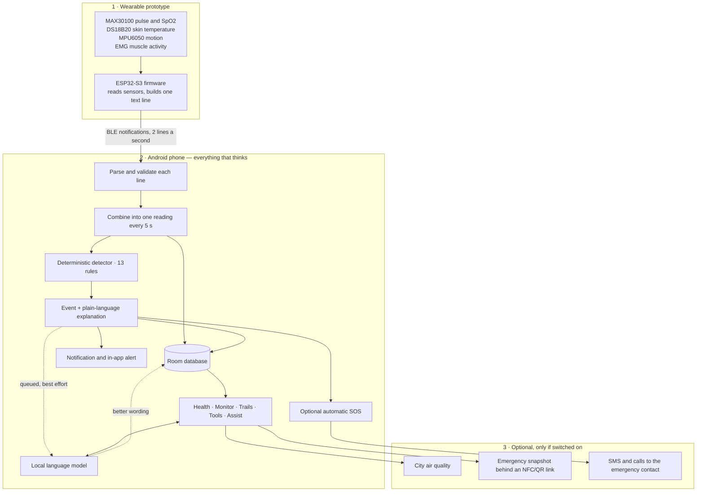
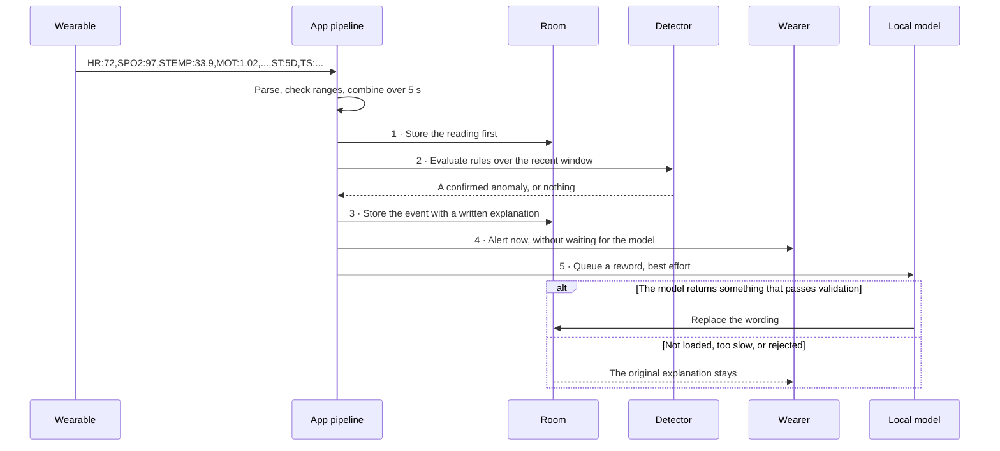
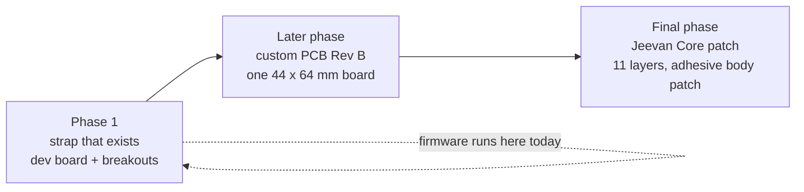

# G-one — complete project description

A plain-language walk through the whole project: what it is, how the parts fit together, what
each part actually does today, and what is still unproven. It covers the Android app, the
wearable firmware, the Bluetooth link between them, all three hardware prototypes and every 3D
file, the tools, and the public website.

Written to be read top to bottom. Every claim here matches the code and the recorded evidence in
[`VERIFICATION.md`](../VERIFICATION.md); where something is a design asset or a presentation
claim rather than a working feature, it says so.

- **What it is:** a personal health companion that runs on the phone, with a wrist-worn sensor prototype.
- **Central rule:** deterministic rules decide health events. The language model only rewords them.
- **Stage:** working prototype with automated tests and recorded bench checks. Not a medical device.

---

## Contents

1. [The project in one page](#1-the-project-in-one-page)
2. [System architecture](#2-system-architecture)
3. [The wearable](#3-the-wearable)
4. [The Bluetooth link](#4-the-bluetooth-link)
5. [The Android application](#5-the-android-application)
6. [The on-device language model](#6-the-on-device-language-model)
7. [Hardware design: the three prototypes](#7-hardware-design-the-three-prototypes)
8. [Every 3D file, listed](#8-every-3d-file-listed)
9. [Supporting tools](#9-supporting-tools)
10. [Data, privacy and what leaves the phone](#10-data-privacy-and-what-leaves-the-phone)
11. [Build, run and test](#11-build-run-and-test)
12. [Repository map](#12-repository-map)
13. [Website and presentation claims](#13-website-and-presentation-claims)
14. [What is proven, and what is not](#14-what-is-proven-and-what-is-not)
15. [Limits and next steps](#15-limits-and-next-steps)

---

## 1. The project in one page

G-one watches a person's vital signs with a small wrist-worn device, sends those readings to an
Android phone over Bluetooth, and does everything else **on the phone**: storing readings,
deciding whether something is wrong, explaining it in ordinary words, and, if the wearer has
switched it on, texting an emergency contact.

The one decision everything else follows from:

```
Sensor  →  deterministic rules  →  confirmed event  →  local model rewords it  →  alert
```

and never

```
Sensor  →  language model  →  "diagnosis"
```

A rule engine with named, reviewable thresholds makes every health decision. The language model
makes none: it never decides whether something is wrong, never sets severity, never invents a
number. If the model fails to load, times out, or writes something that fails validation, the
alert still exists with its original wording.

| | |
|---|---|
| **Phone app** | Native Android, Kotlin and Jetpack Compose, package `com.gone.ai`, API 24+, ARM64 |
| **Wearable** | ESP32-S3-N16R8 with MAX30100, DS18B20, MPU6050 and an EMG module |
| **Link** | Bluetooth LE, HM-10 serial profile (service `FFE0`, characteristic `FFE1`) |
| **Language model** | Qwen2.5-1.5B-Instruct, 4-bit GGUF, run on the CPU through llama.cpp |
| **Storage** | App-private Room database (schema version 5), preferences and files |
| **Optional network** | City air quality, consented emergency snapshot, SMS and calls, Android speech |
| **Tests** | 590 JVM tests in 66 classes, 0 failures; Android lint 0 errors |

---

## 2. System architecture

### The three parts



The wearable only measures. The phone does all storage, all detection and all language work. The
ESP32 does not run the language model.

### Who owns what

| Responsibility | Where it lives |
|---|---|
| Reading sensors, building a line, sending it | Firmware, `firmware/g_one_wearable` |
| Framing bytes into lines, checking units and ranges | `health/source/SensorPacketParser.kt` |
| Reconnecting, clock sync, link health | `health/source/ble/` |
| Combining readings, storing, calling the detector, in order | `health/service/MonitoringPipeline.kt` |
| Deciding whether something is wrong | `health/detect/` and `health/domain/AnomalyThresholds.kt` |
| Wording an alert, then improving it in the background | `health/explain/` and the explanation worker |
| Sharing the one language model between chat and tools | `ai/repository/` |
| Screens and user actions | `health/ui/`, `ui/`, `viewmodel/` |
| Anything that leaves the phone | `health/sos/`, `health/emergency/`, `health/environment/` |

### A reading becomes an alert



**The order is the design.** Storing comes before detecting, detecting before alerting, and the
model last and off to one side. A slow or broken model cannot delay or weaken an alert.

---

## 3. The wearable

### What is on the strap today

| Part | Measures | Connection |
|---|---|---|
| ESP32-S3-N16R8 dev board | — | Runs everything, talks Bluetooth LE |
| MAX30100 breakout | Pulse, blood oxygen | I²C bus 0 — SDA GPIO 8, SCL GPIO 9, address 0x57 |
| MPU6050 (GY-521) | Movement and impacts | I²C bus 1 — SDA GPIO 6, SCL GPIO 7, address 0x68 |
| DS18B20 probe | Skin temperature | 1-Wire GPIO 4, with a 4.7 kΩ resistor to 3V3 |
| EMG module | Muscle activity | Analog GPIO 1 (ADC1), must stay within 0–3.3 V |

The two I²C buses are deliberate: the pulse sensor is read every millisecond from its own task,
so giving the motion sensor a separate bus means neither waits for the other.

### What the firmware does

`firmware/g_one_wearable/g_one_wearable.ino` is the owner's own bench sketch — the one that got
every sensor working — with a Bluetooth layer added. Each change made for the app is marked
`CHANGED FOR THE APP` in the file with its reason.

| Behaviour | Detail |
|---|---|
| Pulse and oxygen | MAX30100 library on its own task pinned to core 0, updated every millisecond |
| Motion | Read about every 2 ms; the line carries the **hardest** movement since the last line, so an impact is never averaged away |
| Skin temperature | Asked for, then collected on a later pass, so the loop is never blocked |
| Muscle activity | Sampled every loop; the line carries the average and the peak since the last line |
| Sending | One line twice a second |
| Clock | No battery-backed clock; the phone sends the time on every connection |
| Serial | A readable block once a second, plus the exact line last sent, for bench checks |

**Live only.** There is no SD card on this build and nothing is kept on the board. A reading made
while the phone is out of range is lost and appears as a gap in the app's record. The app still
speaks the fuller store-and-forward protocol, so a wearable that keeps readings would work
without app changes.

### Three corrections the app needed

| Found | Why it mattered | Fix |
|---|---|---|
| Heart rate sent as a decimal | The app reads whole numbers only, so every reading would have been dropped | Rounded |
| Accelerometer at ±2 g | The fall rule needs a bigger impact than ±2 g can even report | ±8 g, 4096 counts per g |
| A sensor that stops answering keeps its last value | A dead sensor would be shown as a live reading | A value is left out after 5 s without a fresh one |

### Guarding against a stuck heart rate

The MAX30100 library resets its heart rate to zero from only one of its internal states. On the
bench it stuck after the board was knocked and reported **0.3 BPM** with nothing on the sensor;
after a real pulse it would repeat that pulse indefinitely. So the firmware records the time of
every beat the library detects and sends a heart rate only when:

- five beats have been found, and
- the newest is within 2.5 seconds, and
- the library's rate is within 20 % of the rate those beats imply.

Blood oxygen is sent only beside a valid heart rate, because the library derives it from the same
beats. "Touching skin" means a beat within the last three seconds.

### Power settings, and the one hardware fix still outstanding

The board restarted repeatedly on the bench with a brown-out. Measuring its own I²C lines at
start-up showed the MAX30100 module pulls the bus to its internal **1.8 V**, while the ESP32-S3
needs about 2.5 V to read a "1". That explains a pulse sensor that answered on some boots and not
others, and a heart rate that never arrived.

**Outstanding, in hardware: 2.2 kΩ from SDA to 3V3 and from SCL to 3V3.** Until those are fitted
the firmware copes and prints `TOO LOW` at start-up, and reduces current draw:

| Setting | Value | Reason |
|---|---|---|
| CPU speed | 80 MHz, not 240 | Less current and less heat; every sensor and Bluetooth still work |
| Bluetooth power | 3 dBm, not 9 | Smaller current spikes |
| Pulse sensor bus | 100 kHz, not 400 kHz | Four times as long for a weakly pulled-up line to rise |
| Missing sensor | Asked three times at start-up, then every 5 s | Recovers without a restart |

---

## 4. The Bluetooth link

| Item | Value |
|---|---|
| Advertised name | `G-one Wearable` |
| Service / characteristic | `FFE0` / `FFE1` |
| Transport | Notifications out, writes without response in; the phone asks for MTU 185 |
| Framing | Newline-terminated ASCII; split and merged notifications are reassembled |
| Payload | Comma-separated `KEY:VALUE`; unknown keys ignored, so firmware can add fields safely |

A live line looks like this:

```
HR:72,SPO2:97,STEMP:33.90,MOT:1.02,EMG:1234,EMGPK:1810,EMGBITS:12,ST:5D,TS:1726470000000
```

| Key | Meaning | Accepted by the app |
|---|---|---|
| `HR` | Heart rate, whole beats per minute | 20–300 |
| `SPO2` | Blood oxygen, % | 50–100 |
| `STEMP` | **Skin** temperature, °C | 20–42 |
| `TEMP` | **Core** temperature, °C — not sent by this hardware | 25–45 |
| `MOT` | Hardest movement since the last line, g | 0–16 |
| `EMG` / `EMGPK` | Muscle level and peak, raw ADC counts | 0–4095 |
| `EMGBITS` | ADC resolution of those counts | must be `12` |
| `ST` | Status bits, hex | see below |
| `TS` | When the reading was taken, epoch ms | within 2 min ahead / 30 days back |

Status bits: `0x01` pulse sensor found, `0x02` a pulse is being found, `0x04` thermometer found,
`0x08` motion sensor found, `0x10` EMG signal looks connected, `0x20` card working (always clear
on this build), `0x40` clock set by the phone. The app turns clear bits into plain sentences, for
example *"Motion sensor not detected — falls cannot be detected"*.

**Phone to wearable:** `T:<epoch ms>` sets the clock. `ACK:<n>` and `STOP` belong to the
store-and-forward protocol; this firmware ignores them.

**Units are checked, not assumed.** A skin temperature sent in Fahrenheit lands outside 20–42 and
is dropped rather than read as a fever. EMG counts are rejected unless the line says they are
12-bit. A missing field means "not measured" and never becomes a zero.

Full description: [`WEARABLE_PROTOCOL.md`](WEARABLE_PROTOCOL.md).

---

## 5. The Android application

### Module map

| Package | What it holds |
|---|---|
| `health/source/` | Parsing, validation, 5-second aggregation, simulated sources |
| `health/source/ble/` | Connecting, reconnecting with back-off, stale-link watchdog, clock sync |
| `health/service/` | Foreground monitoring service, the pipeline, wearable preferences, reminders |
| `health/detect/`, `health/domain/` | The 13 rules, thresholds, baselines, risk scores — plain Kotlin, no Android |
| `health/explain/` | Written explanations, tiers and the model-rewrite validation |
| `health/session/` | Sessions, report building, PDF layout and writing |
| `health/sos/` | Automatic emergency texting and calling |
| `health/emergency/`, `health/nfc/` | Consented emergency snapshot, NFC tag writing, QR codes |
| `health/environment/` | Optional city air quality |
| `health/ui/` | Health, Live Monitor, Trails, Device and report screens |
| `ai/`, `chat/` | Shared model runtime, prompts, context budgets |
| `ocr/`, `pdf/`, `circle/` | Text from images and documents, screen capture tools |
| `data/library/` | Room database and the Memory Vault |
| `voice/` | Speech in and out |

### The pipeline, in order

1. **Store the reading.** Nothing downstream can lose data already on disk.
2. **Detect**, deterministically, over an in-memory window. No model, no network.
3. **Store the event** together with its written explanation.
4. **Alert** the wearer immediately, with that wording.
5. **Queue** an optional reword, and return.

Readings that arrive late or are replayed from the past are stored and checked by the same rules,
but never raise a notification — an alert about something three hours old reads as happening now.

### The 13 rules

| Rule ID | Watches for |
|---|---|
| `spo2.critical` / `spo2.sustained` | Critically low oxygen / a sustained low pattern |
| `hr.high` / `hr.low` | Sustained fast or slow heart rate |
| `temp.fever` | Raised **core** temperature, when a core sensor exists |
| `env.heatStress` / `env.dehydrationRisk` | Combined heat and dehydration indicators |
| `resp.distress` / `cardio.strain` | Combined respiratory and cardiovascular patterns |
| `motion.fall` | A hard impact, with supporting conditions |
| `wellness.fatigue` | A fatigue pattern |
| `emg.sustainedHigh` | Muscles held tense |
| `baseline.deviation` | A departure from this person's own baseline |

Skin temperature never feeds a fever rule. Risk scores are engineering indicators, not
probabilities of illness. A missing value is never treated as a zero or as evidence of stillness.

The fall threshold is **5.0 g**, raised from 2.5 g so that ordinary knocks do not raise events or
occupy the cooldown before a harder impact. It is an engineering setting, not a validated fall
classifier, and it may miss gentler falls.

### Automatic SOS

Off until switched on in Settings, and it needs a saved contact and Android's SMS permission.

| | |
|---|---|
| **What sends** | Every confirmed **live** anomaly from the wearable, including low and moderate ones. Motion additionally needs a finite impact of at least 5.0 g |
| **What never sends** | Simulated readings, replayed history, air quality |
| **Grouping** | Alerts raised within 1.5 s go in one message, so one reading cannot produce several texts |
| **Countdown** | None. Saved countdown values from earlier versions are ignored |
| **Calling** | Optional and separately permissioned; the text goes first |
| **Needs** | A working SIM and signal. A successful send is not proof the contact read it |

Details and the physical tests still to do: [`SOS_BEHAVIOR.md`](SOS_BEHAVIOR.md).

### Sessions and the PDF report

A session records a stretch of monitoring. Ending it builds a report from what was actually
stored: how long, how many readings, the range of each channel, five representative points
through the session, charts, and the alerts raised. It states plainly when a channel received
nothing, and it counts gaps where readings stopped for more than a minute.

The report has been produced end to end from a real 19-minute session on the wearable, and every
figure in it matched the stored readings. The last part of the PDF is the local model's summary of
the deterministic observations above it, labelled as such.

### Tools and Assist

| Tool | What it does |
|---|---|
| Assist | Local streaming chat with formatting, stop and retry, history, and optionally the wearer's own health context |
| OCR | Reads text from a photo or the camera with ML Kit, on the phone |
| PDF summary | Extracts text from a document and summarises it locally |
| Screenshot explainer | Explains captured screen content, text first |
| Circle to Search | Select part of the screen and ask about it |
| Quiz | Turns text into questions with answers and a score |
| Memory Vault | Saved scans, summaries and quizzes, searchable, deletable |
| Voice | Android speech recognition and text to speech, with TalkBack labels throughout |

General chat is not covered by the strict health-rewrite validation and can be wrong.

### Air quality, sleep and stress

Air quality is **off by default**. Switched on, you search for a city and pick one; no location
permission is requested. Open-Meteo returns a modelled **US AQI**, which is not India's National
AQI and not a sensor on the body. Refreshes are at least 15 minutes apart, failures fall back to
the last good value with its timestamp, and anything older than three hours is marked stale.

Sleep and stress are **self-reported journals**: bedtime, wake time, minutes awake and a 1–5
quality rating; a 1–5 daily stress rating. Seven-day views leave missing days out of averages.
They are records the wearer keeps, not automatic sleep staging or stress detection.

### Emergency sharing over NFC or QR

The wearer picks which profile fields to share and turns sharing on. The phone uploads that
snapshot and writes a **stable link** to an NFC tag or QR code. The tag holds an address, not a
copy of the data, so updating the record behind it keeps the same tag current.

The phone keeps a private edit secret and hands out a separate read identifier. Anyone with the
read link can see that record; it is read-only and shows when it was last updated. Revoking
completes only once the server confirms deletion. Details:
[`NFC-EMERGENCY-SHARING.md`](NFC-EMERGENCY-SHARING.md).

---

## 6. The on-device language model

| | |
|---|---|
| Model | Qwen2.5-1.5B-Instruct, GGUF Q4_K_M, 1,117,320,736 bytes |
| Runtime | Vendored llama.cpp/ggml through a JNI bridge, CPU only, 4 threads |
| Context | 4,096 tokens; 3,568 for the prompt, 512 for the answer |
| Sharing | One shared instance; chat and tools take leases, requests are serialised |
| Release | Freed 60 seconds after the last lease closes |
| Delivery | Bundled in the APK and copied to app-private storage on first use |

That bundling is why the release APK is about **1.13 GiB**, of which the model is about 94 %. It
buys first use with no download.

**Health explanations are constrained.** The model is given the finished, deterministic
explanation and asked to reword it. The result is validated before it replaces anything: it may
not introduce numbers, advice or diagnoses. If it does, the original stays. One limit found in
testing: the check does not catch a statement that is simply wrong in words — in one report the
model added "with no further readings after that" when readings had in fact continued.

---

## 7. Hardware design: the three prototypes

Three separate models, each in its own folder, each with its own README. They are **visual and
mechanical** work: none of them is a fabrication deliverable, and none contains Gerbers or a
verified electrical netlist.

### 7.1 Phase 1 — the strap that exists

`hardware/gone-phase1-strap/` — a Blender reconstruction of the real prototype, built from eleven
photographs that are packed inside the .blend file.

| | |
|---|---|
| What it shows | A black cuff on a forearm with a closed fist: inverted ESP32-S3 dev board, yellow headers, loose wiring, four axial resistors, insulation tape and a steel temperature probe |
| Scenes | `01 \| Worn Phase-1 prototype` and `02 \| Opened strap — sensor inspection` |
| Modules modelled | ESP32-S3 board, Muscle BioAmp Patchy (red), MAX30100/30102 breakout (green), MPU6050 GY-521 (blue), temperature probe |
| Size | 1,684 objects, 11 packed reference photos |
| Renders | `phase1-worn.png`, `phase1-hardware.png`, `phase1-inside.png`, `phase1-opened.png` |
| Scale cue | Nominal 2.54 mm header pitch |

**Limits:** photo-derived, not a scan. Strap dimensions, hidden mounting, resistor values and
obscured wire routing are approximations; the closed fist is modelled approximately because the
photographs do not show it. The digital wiring is not a verified netlist.

### 7.2 Later phase — the custom PCB, Rev B

`hardware/gone-pcb-3d/` — what the strap could become as one integrated board, rather than dev
boards stacked together.

| | |
|---|---|
| Board | 44 × 64 × 1 mm, six mounting holes; one Blender unit = 1 mm |
| Contents | 905 objects in 12 numbered collections: laminate and plating, ESP32-S3-WROOM-1-N16R8, MPU6050, microSD socket, EMG front end, charger and buck-boost, USB-C and switches, skin-side MAX30102, DS18B20 thermal island, routing relief and silkscreen, optional battery envelope, studio |
| Rev B added | A realistic pouch-cell assembly with sealed edges and a removable polymer carrier on the existing mounting holes; three editable battery harness curves; TP4056 charger with separate DW01A / FS8205A protection; exposed FR-4 edges, copper lands, refined USB-C shell; a corrected capacitor/regulator overlap |
| Renders | Eight 1800 × 1800 Cycles views: assembled, top, bottom, isometric, side, sensor macro, ESP32/power, analog/USB |
| Rev A preserved | `G-one-PCB-before-enhancement.blend` and its GLB |

**Limits:** visible copper is surface detail, not routed nets. The 30 × 26 × 5 mm cell envelope is
provisional, connector polarity and the thermistor circuit need checking, and the EMG analog
design is unresolved. **This model must not be used to order PCB fabrication.** It also shows a
**MAX30102**, while the firmware drives a **MAX30100**; that substitution needs a different driver.

### 7.3 Final phase — the Jeevan Core patch

`hardware/jeevan-core/` — a concept for a reusable body patch, built as **eleven mechanical
layers** that can be exploded apart, with a working web viewer.

| # | Layer | What it is |
|---|---|---|
| 01 | Protective enclosure | Pearl polymer shell, recessed identity panel, USB-C service opening |
| 02 | Status light guide | Carries the PCB's LED to the front indicator |
| 03 | Perimeter gasket | Elastomer seal — sealing performance untested |
| 04 | Main electronics | ESP32-S3 N16R8, ECG and EMG front ends, MPU6050, BME280, charging, microSD |
| 05 | Rechargeable cell | Protected pouch-cell envelope; capacity awaits cell selection |
| 06 | Inner support frame | Battery pocket, board supports, screw bosses, flex passage |
| 07 | Flexible sensor interface | Polyimide substrate with optical and temperature sensing |
| 08 | Skin-side spacer | Silicone carrier with optical and electrode apertures |
| 09 | Electrodes and optical interface | Two ECG, two EMG, one BioZ and one temperature contact |
| 10 | Replaceable adhesive | Die-cut layer with apertures; material qualification pending |
| 11 | Peel-away liner | Protects the adhesive before use |

| | |
|---|---|
| Envelope | Provisional 30 × 50 × ~13 mm reusable body, 24 × 40 × 1 mm main PCB |
| Animation | Frame 1 assembled, frame 121 exploded, as an `Explode` clip |
| Viewer | React + three.js in `web/`, drag to rotate, slider, layer index, keyboard and screen-reader support, and a full text fallback if WebGL fails |
| Renders | `core-assembled.png`, `core-exploded.png`, `core-skin.png` |

**Limits:** the illustration's 8 mm thickness and 28 × 24 mm PCB are **not** asserted. Electrode
spacing follows the concept image and is not established as workable for ECG, EMG or BioZ.
Battery life, ingress protection, biocompatibility and adhesive lifetime are not established, and
the web copy deliberately avoids the unvalidated "5–7 day" and "IP67" claims.

### How the three relate



Only Phase 1 exists physically and runs the firmware. The other two are design studies.

---

## 8. Every 3D file, listed

Sizes are rounded; triangle and mesh counts come from the export reports beside each model.

### Phase 1 strap

| File | Size | Notes |
|---|---|---|
| `G-one-Phase-1-Strap.blend` | 6.7 MB | Editable source, both scenes, 11 packed photos |
| `G-one-Phase-1-Strap.glb` | 36.3 MB | Full geometry: 1,089 meshes, 1,483,516 triangles, 28 materials |
| `G-one-Phase-1-Strap-web.glb` | 20.6 MB | For the web: 9 groups, 694,586 triangles, curved surfaces simplified |
| `phase1-worn.png`, `phase1-hardware.png`, `phase1-inside.png`, `phase1-opened.png` | ~2.7–3.2 MB each | Final Cycles renders |
| `phase1-preview.png`, `phase1-refined-preview.png` | ~1 MB each | Earlier intermediate renders |
| `build_phase1.py` → `refine_phase1.py` → `finish_phase1.py` → `final_check_phase1.py` → `render_final_phase1.py` | 1–23 KB | Construction history, in order |
| `export_glb.py`, `export_glb_web.py` | 6 KB each | GLB exporters |
| `model-report.json`, `geometry-audit.json`, `glb-export-report.json`, `glb-web-export-report.json` | <1 KB each | Inventory and validation |

### Custom PCB

| File | Size | Notes |
|---|---|---|
| `G-one-PCB.blend` | 2.9 MB | Rev B, editable, 905 objects in 12 collections |
| `G-one-PCB.glb` | 15.5 MB | 1,157 meshes, 324,162 triangles, 24 materials |
| `G-one-PCB-before-enhancement.blend` | 2.8 MB | Preserved Rev A |
| `G-one-PCB-before-enhancement.glb` | 11.1 MB | 892 meshes, 233,574 triangles, 15 materials |
| `assembled.png`, `isometric.png`, `top.png`, `bottom.png`, `side.png`, `sensors.png`, `esp32-power.png`, `detail.png` | ~2.9–3.9 MB each | Eight Cycles views |
| `layout-reference.png` | 2.3 MB | The original reference illustration |
| `build_pcb.py`, `enhance_pcb.py`, `finish_enhanced.py`, `finalize_rev_b.py`, `refine_cameras.py`, `export_glb.py`, `audit_enhanced.py`, `validate_model.py` | 1–22 KB | Rev A builder, Rev B enhancement chain, exporter, audits |
| `model-inventory.json`, `validation.json`, `enhancement-validation.json`, `mechanical-audit.json`, `glb-export-report.json` | <1 KB each | Inventories, clearance checks, export validation |

### Jeevan Core

| File | Size | Notes |
|---|---|---|
| `Jeevan-Core.blend` | 483 KB | Editable source, three cameras, layer animation |
| `Jeevan-Core.glb` | 18.6 MB | 11 named layer parents, 333,846 triangles, `Explode` clip, self-contained |
| `core-assembled.png`, `core-exploded.png`, `core-skin.png` | ~2.2–2.3 MB each | Cycles renders |
| `layers.json` | 2 KB | Stable IDs, titles, descriptions and explode distances |
| `build_core.py`, `refine_core.py`, `export_core.py`, `render_core.py` | 1–17 KB | Construction, refinement, export, renders |
| `export-report.json`, `gltf-validation.json` | <8 KB | Export and glTF validation |
| `web/` | — | React viewer (`CoreExplorer.jsx`, `layers.json`, `style.css`), Vite build |

**Common to every GLB:** metres, glTF Y-up, self-contained buffers, no Draco or Meshopt decoder
needed, portable base-colour/metallic/roughness materials. Each export was re-imported to confirm
mesh counts and bounds, and each source .blend's SHA-256 was checked unchanged afterwards.

**Rebuilding:** the construction scripts start a new scene. Never run them over a hand-edited
final file — open the saved .blend instead, or follow the chain documented in that model's README.

---

## 9. Supporting tools

| Tool | What it does |
|---|---|
| `tools/wearable-emulator/emulate.py` | Plays the wearable from a PC. `--selftest` runs the whole sync protocol against a simulated phone on a virtual clock — 10 scenarios including going out of range, the app being killed mid-replay, a restart before the clock is set and a flaky link. Needs no hardware |
| `tools/wearable-check/check_wearable.py` | The opposite: the PC acts as the **phone** against the real board over Bluetooth, checking every field against the app's own rules and comparing each line received with the line the board printed on USB |

The emulator's self-test found a real protocol bug during development: a status line sent before
the records it described meant catch-up could never end.

---

## 10. Data, privacy and what leaves the phone

"Local AI" does not mean every feature is offline, and it does not mean the database is encrypted.

| Path | Local by default | What can leave the phone |
|---|---|---|
| Detection and language model | Yes | Nothing |
| OCR, Vault, sessions and reports | Yes | Only what the wearer exports or shares |
| Sleep and stress journal | Yes | Nothing; app-private preferences |
| Air quality, if switched on | No | City name or centre coordinates; the request reveals an IP address |
| Emergency snapshot, if switched on | No | The fields the wearer selected |
| Automatic SOS, if switched on | Carrier | SMS and optional call to the saved contact |
| Voice recognition | Depends on Android | May use online recognition if no offline pack exists |

The database is app-private SQLite, **not encrypted**. Cloud backup is switched off so readings,
chats and reports are not copied to a cloud account; device-to-device transfer keeps the data but
not the 1 GB model, which the app extracts again on first launch.

---

## 11. Build, run and test

```powershell
.\gradlew.bat :app:assembleDebug
.\gradlew.bat :app:testDebugUnitTest :app:lintDebug
.\gradlew.bat :app:connectedDebugAndroidTest      # needs a connected phone
python tools/wearable-emulator/emulate.py --selftest
```

Firmware, with arduino-cli:

```
arduino-cli compile --fqbn esp32:esp32:esp32s3:FlashSize=16M,FlashMode=qio,PSRAM=opi,PartitionScheme=app3M_fat9M_16MB,CDCOnBoot=cdc firmware/g_one_wearable
```

Libraries: MAX30100lib (OXullo), NimBLE-Arduino 2.x, OneWire, DallasTemperature, with the esp32
board package. Board settings are in [`HARDWARE_SETUP.md`](HARDWARE_SETUP.md).

**First run on a phone:** install, allow the model to be prepared, choose the wearable on the
Device screen, grant Bluetooth and notification permissions, then start monitoring. Calibrate the
EMG levels on the wearer before trusting muscle alerts. Air quality, emergency sharing and SOS
are each switched on separately.

---

## 12. Repository map

```text
app/src/main/java/com/gone/ai/
  ai/ chat/          shared local model runtime, prompts, context budgets
  health/
    source/ ble/     parsing, validation, aggregation, the Bluetooth link
    service/         foreground monitoring service and the pipeline
    detect/ domain/  the 13 rules, thresholds, baselines, risk scores
    explain/         written explanations and model-rewrite validation
    session/         sessions, reports, PDF
    sos/             automatic texting and calling
    emergency/ nfc/  consented snapshot, NFC tags, QR codes
    environment/     optional city air quality
    ui/              health screens
  ocr/ pdf/ circle/  text from images and documents, screen tools
  data/library/      Room database and Memory Vault
  voice/             speech in and out
app/src/main/cpp/    JNI bridge and vendored llama.cpp/ggml
app/src/test/        590 JVM tests
app/src/androidTest/ migrations and TalkBack label checks
firmware/
  g_one_wearable/    the firmware that runs on the strap
  g_one_doctor/      the owner's bench sketch, kept as the known-good reference
  g_one_tracer/      finds which pin a loose wire is really in
hardware/
  gone-phase1-strap/ the strap that exists
  gone-pcb-3d/       custom PCB, Rev A and Rev B
  jeevan-core/       final-phase patch concept and web viewer
tools/               wearable emulator and checker
docs/                this file, protocol, hardware, SOS, NFC, AQI guides
VERIFICATION.md      what was actually run, and what it showed
```

---

## 13. Website and presentation claims

The public site is <https://g--one.vercel.app/>, with pages for the patient app, an India
telemetry map, the hardware explorer, the signal-to-AI pipeline, the team, and the emergency ID
entry point at `/e`.

It is a **presentation** of the project, and some of its figures describe an intended product
rather than this build:

| Website says | This build actually does |
|---|---|
| 250 Hz sampling | Two readings a second over Bluetooth; one stored reading every five seconds |
| 72-hour offline buffer | Live only — nothing is stored on the wearable; out-of-range readings are lost |
| Encrypted local SQLite | App-private SQLite, not encrypted |
| HRV, arrhythmia triggers, siren, multi-contact SOS | Heart rate, SpO₂, skin temperature, motion and EMG; 13 rules; SMS and an optional call to one saved contact |

When the two disagree, this document and `VERIFICATION.md` are the accurate ones.

---

## 14. What is proven, and what is not

### Measured or observed

| Evidence | Result |
|---|---|
| JVM tests | 590 tests, 66 classes, 0 failures |
| Android lint | 0 errors |
| Firmware build | Compiles with no warnings from the sketch; about 21 % of the 3 MB app partition |
| Protocol self-test | 10 of 10 scenarios |
| On the phone and board | Connects and sets the clock within seconds; 112 stored values checked against the board's own log with none disagreeing; Stop reaches the board in about 2.5 s; a 9.47 g jolt raised a fall alert; a 19-minute session produced a PDF whose every figure matched the stored readings |
| Instrumented tests | 19 of 19 on a Samsung SM-S721B |
| Recorded prompt speed | 28.9 tokens/s on one quiz prefill on that phone |

### Not established

- **A heart rate from the wearable has never reached the app.** The pulse sensor's bus sits at
  1.8 V and the fix (2.2 kΩ pull-ups) is not yet fitted.
- **Board power is unstable:** repeated brown-outs, a hot board and sensors that vary from boot to
  boot point to a wiring fault rather than firmware.
- **A real SOS text and call** have not been sent from the phone.
- Fall sensitivity, false-positive rates, battery life, sustained generation speed, memory use and
  thermal behaviour are unmeasured.
- The PCB and Jeevan Core designs have had no electrical review or fabrication.

---

## 15. Limits and next steps

| Limitation | The next meaningful step |
|---|---|
| Pulse sensor never delivers a rate | Fit the 2.2 kΩ pull-ups, then confirm a heart rate against a manual count |
| Unstable board power | Find the heat source, then a decoupling capacitor and firm power rails |
| Live-only transport | Implement and verify buffering and gap recovery on the board |
| Engineering thresholds | Evaluate sensitivity and false positives with proper oversight |
| Self-reported sleep and stress | Validate any automatic inference before calling it automatic |
| 1.13 GiB APK | Pin the model's provenance; weigh smaller models against quality |
| Unencrypted database | Evaluate encryption, key lifecycle and migration |
| Public-by-link emergency record | Improve owner recovery and revocation, and get a security review |
| Concept hardware | Electrical review, tolerances, fabrication and assembly testing |

No claim is made for certification, guaranteed fall detection, diagnostic accuracy, waterproofing,
multi-day battery life or universal device compatibility. G-one is a prototype that records sensor
readings and explains them; it is not a diagnosis.

---

## Where to read more

| Document | Contents |
|---|---|
| [`../README.md`](../README.md) | Full engineering README with diagrams and evidence tables |
| [`../VERIFICATION.md`](../VERIFICATION.md) | What was run, what it showed, what still needs hardware |
| [`HARDWARE_SETUP.md`](HARDWARE_SETUP.md) | Parts, wiring, power and bench checks |
| [`WEARABLE_PROTOCOL.md`](WEARABLE_PROTOCOL.md) | Every field, status bit and command |
| [`SOS_BEHAVIOR.md`](SOS_BEHAVIOR.md) | Exactly what sends an SOS, and what does not |
| [`NFC-EMERGENCY-SHARING.md`](NFC-EMERGENCY-SHARING.md) | Provisioning, refresh, deletion, deployment |
| [`OPTIONAL-AQI-WELLNESS.md`](OPTIONAL-AQI-WELLNESS.md) | Air quality and the wellness journals |
| [`../hardware/gone-phase1-strap/README.md`](../hardware/gone-phase1-strap/README.md) | The strap model |
| [`../hardware/gone-pcb-3d/README.md`](../hardware/gone-pcb-3d/README.md) | The custom PCB model |
| [`../hardware/jeevan-core/README.md`](../hardware/jeevan-core/README.md) | The Jeevan Core model and viewer |
