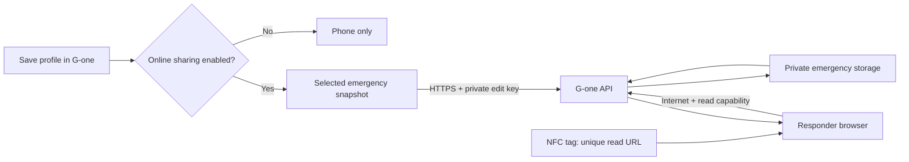

# NFC emergency sharing — implementation and operating plan

## What changes when you save in the app

A passive NFC sticker is a small memory chip, not a radio-connected display. G-one writes
a **stable HTTPS URL once**. It does not rewrite the sticker over the internet. With the
wearer's explicit online-sharing consent, the app updates the record behind that URL.
A subsequent scan retrieves the latest successful upload. An already-open page checks
again every 15 seconds while visible. It never fabricates a live connection or medical state.

The existing `https://g--one.vercel.app/e` is a generic address shared by every tag containing
it. It cannot identify its wearer. It now displays setup guidance instead of demo clinical
data. **The physical tag must be rewritten once** with the app-generated unique link.
No remote software change can discover a wearer's identity from the original generic URL.

## Wearer setup

1. Install the updated G-one APK. Open **Emergency Medical ID**.
2. Review your saved medical details and sharing toggles, then **Save**.
3. Select **Enable online sharing…**, read the data-sharing explanation, and confirm.
4. Wait for a successful **Last upload** timestamp; use **Open my emergency page** to check it.
5. Select **Updating web link** in NFC formats, tap **Write Web URL to Tag**, and hold the tag
   against the phone until the write has been read back and verified. The NFC tag must be writable.
6. Test on another NFC-capable phone with internet. The same unique URL can be encoded as a web QR.
7. Edit a saved field, save, and refresh the same web page. No further tag rewrite is needed.

The old 10-character local Emergency ID is not the public read credential. The web URL uses
a separate 64-character capability. Do not manually append the old ID to `/e`.

## Shared data and privacy

- Online sharing is **off by default**; existing local share toggles do not silently enable uploads.
- The explicit consent covers saved name, age, blood group, implants, contact, selected allergies /
  conditions / medications, and optionally last wearable readings. No sleep journal, stress journal,
  precise location, full health history, chat, model inputs or AI output is uploaded.
- Optional measurements are from Room records marked **BLE**, never SIMULATED or MANUAL.
  Skin and core temperature stay separate. Each snapshot includes the actual reading timestamp.
  Historical BLE readings may be shown with their original time; there is no promise they are current.
- A raw acceleration spike is not labelled a confirmed fall. Missing data is not labelled normal.
- Anyone holding the read URL can read the chosen fields without an account. The URL is not proof of
  the wearer's identity or authenticity of self-reported information. Copies can be shared by holders.
- The phone creates a random 256-bit edit key. The read ID is SHA-256 of the UTF-8 hex edit key.
  The tag/browser never receives the edit key. PUT/DELETE must prove possession of that key.
- The edit key is held in Android's private `noBackupFilesDir`, excluded from backup/device transfer.
  It is not recoverable after uninstall/clear-data or loss of that phone. **Revoke before uninstalling.**
  Account-based recovery, authenticated caregiver accounts and ownership transfer are future work.
- Server credentials stay in Vercel server environment variables, never in the APK or browser bundle.
  Storage uses a dedicated private `gone-emergency-v1` bucket in the Supabase project already configured
  for this web repository. There is no public bucket or anonymous storage policy added by this feature.
- API responses are no-store; the viewer uses no browser medical-record storage, no analytics,
  no referrer leakage and no search indexing. Hosting/access logs can still contain the read URL;
  server operators must treat those URLs as sensitive. Already viewed screenshots/copies cannot be revoked.

## Updates, offline conditions and revocation

| Situation | Actual behavior |
|---|---|
| Saved medical/profile edits | Immediate upload attempt after saving if sharing is enabled |
| Real wearable monitoring | Upload attempt at most once per 30 seconds, outside the detection/SOS pipeline |
| Background / lost connectivity | Network-constrained persisted Android jobs retry; periodic check nominally 15 min, subject to OS scheduling |
| Phone force-stopped or battery-restricted | Android may delay jobs until the app runs again; server retains the last uploaded snapshot |
| Responder first scan without internet | No online record can be retrieved; explicit unavailable state |
| Responder loses network after viewing | In-memory last loaded record stays visible with a failed-refresh warning and original times |
| Share toggle removed and saved | Full replacement upload removes that field; pending warning if upload fails |
| Stop sharing | Uploads stop, DELETE is attempted; failure explicitly says old record remains accessible |
| Successful DELETE | Subsequent fetch is unavailable; an open page clears it at its next successful poll |
| Generate new identity | Old online record must first be deleted; new consent creates a new capability; rewrite tag / QR |
| Offline text NFC / QR | Static snapshot only; compatible reader required; must be physically rewritten / regenerated |

NFC reader mode no longer skips NDEF discovery and remains active during writing. Every write
is read back before reporting success. Capacity errors are reported rather than silently truncating
medical information. Offline compact fallback omits undated dynamic vitals.

The URI mode is the most interoperable option for browser opening. iPhone background NFC handling
looks for an NDEF URI; arbitrary text/vCard records do not universally pop up as a medical page.
An offline HTML `data:` URI is not used for QR because phone-camera handling and QR capacity vary.

## Deployment, validation and remaining physical checks

Web project: `D:\Endeavors\Coding\Projects\G(one) -\G-(one) - Web App`.
Server variables: `EMERGENCY_STORAGE_URL`, `EMERGENCY_STORAGE_KEY` (service role, server-only).
`scripts/setup-emergency-storage.mjs` creates/checks the dedicated private bucket using local server
variables. No real profile is published by setup. `scripts/test-emergency-api.mjs [base URL]` tests
synthetic create/read/update/withdraw/revoke behavior and deletes its test record in `finally`.
The route rejects unknown fields, oversize bodies, invalid measurements and untimestamped vitals.
Vercel's API write rate limit is configured separately; normal response reads are not challenged.

Before relying on it for a demonstration: complete the six setup steps, verify a real physical tag
on Android and iPhone, test airplane-mode failures and recovery, and confirm revocation. Physical tag
access is needed for that check; a browser/API test alone is not proof of NFC antenna/read compatibility.
This implements emergency information sharing, not a clinically validated emergency response system.

References: [Android NFC dispatch](https://developer.android.com/develop/connectivity/nfc/nfc),
[Apple background tag reading](https://developer.apple.com/documentation/corenfc/adding-support-for-background-tag-reading),
[Supabase private buckets](https://supabase.com/docs/guides/storage/buckets/fundamentals).

### Verification record — 19 September 2026

- Android: 583 JVM tests passed; debug lint has zero errors (52 warnings across the existing app).
  Android instrumentation tests compile; they were not executed on a device in this change.
- Release APK built successfully at `app/build/outputs/apk/release/app-release.apk`.
- Web: production Next build and focused ESLint passed; four validation/capability unit tests passed.
- Seventeen API integration checks passed locally and on `https://g--one.vercel.app`, including
  anonymous-storage denial and immediate revocation. All synthetic test records were removed.
- Browser: inspected generic `/e`, a labelled synthetic populated record, update at the same URL,
  removed fields, measurement timestamps, and automatic clearing after revocation at mobile width.
- No real user medical record was uploaded. No phone was connected at the final build, so the new
  APK was not installed and physical NFC write/read, iPhone interoperability, Android background
  retry timing and full offline/reconnection behavior remain hands-on acceptance checks.
